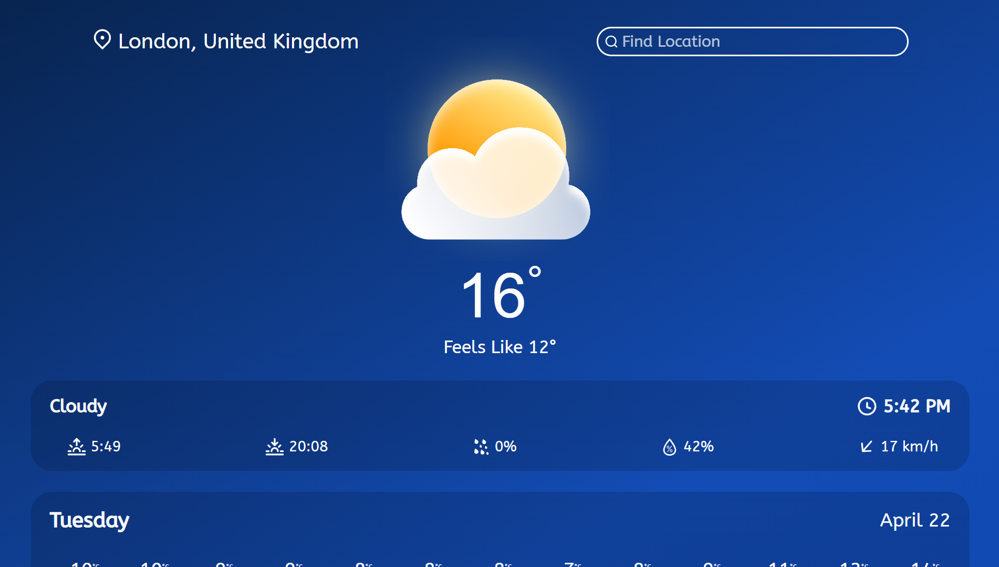
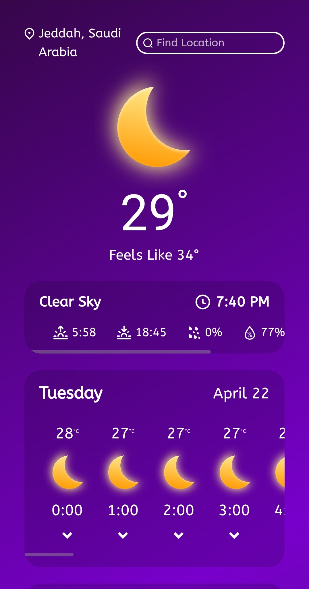

# weather-app

A sleek, responsive weather app that delivers accurate 7-day forecasts and hour-by-hour weather predictions for any location worldwide.

## 📷Screenshots:

### Desktop View

### Mobile View

## Live Demo

👉 [wdataw.github.io/weather-app](https://wdataw.github.io/weather-app/)

## Features:

- 🔮 7-Day Weather Forecasts
- 🕒 Hour-by-Hour Forecast for each of the 7 days.
- 🔄 Weather data refreshes every 15 minute.
- 📱 Mobile-First Responsive Design.
- 🎨 Dynamic Theme Switching (Based on local-time and weather).
- 👤 Clean, User-Friendly Interface.

## Built With:

- html.
- css.
- Javascript.
